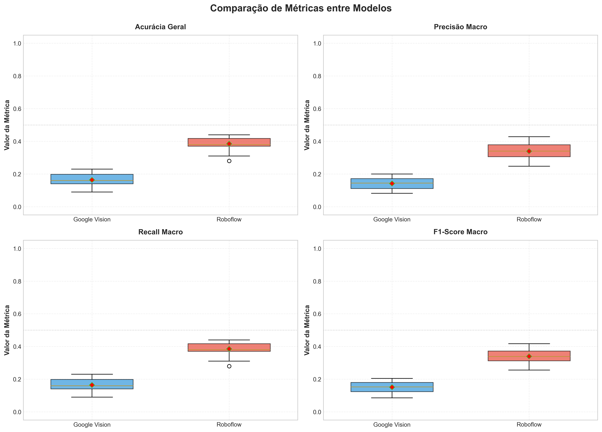
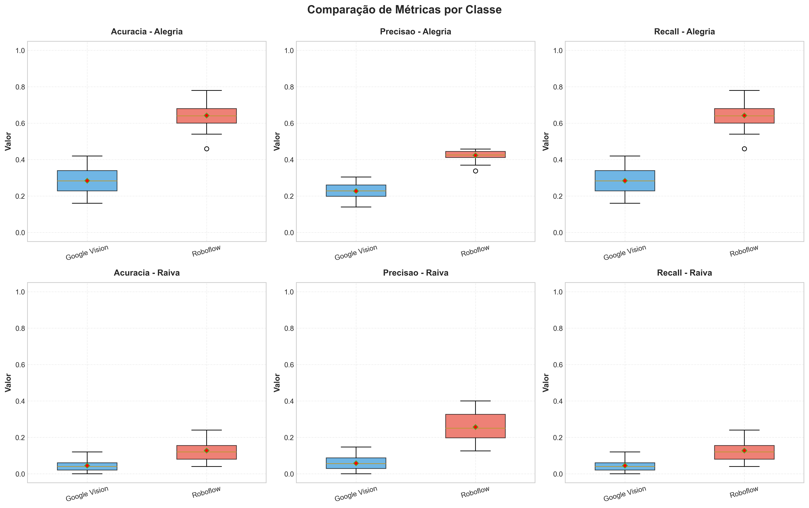
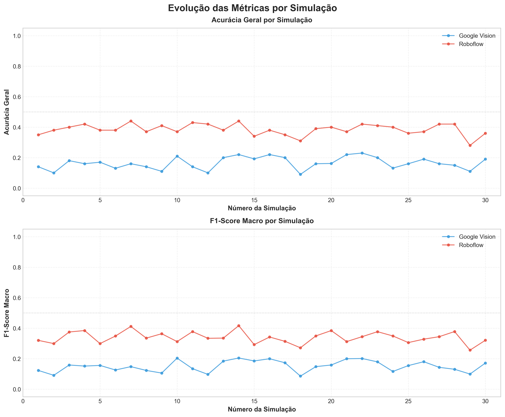
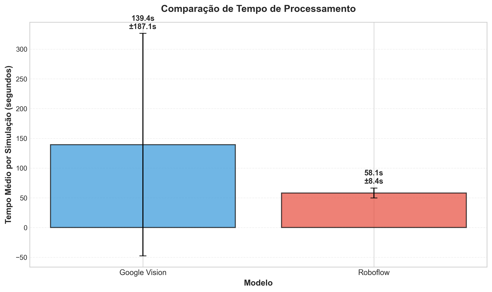
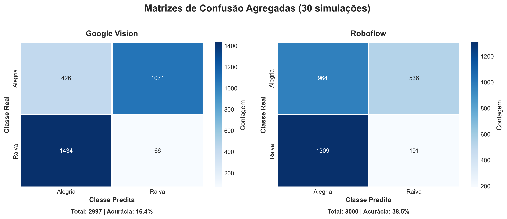
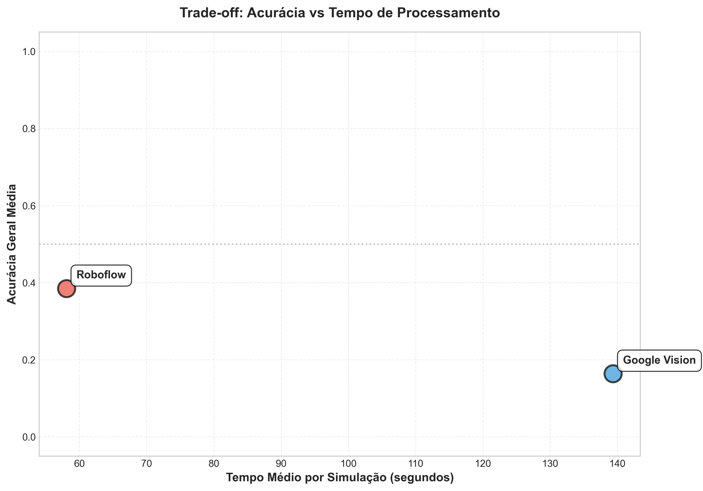

# Relatório de Análise Comparativa

## Classificadores de Emoções Faciais: Google Vision vs Roboflow (Yolo)


```
Data de geração: 29 de November de 2025, 14:16
```
## 1. Introdução
### 1.1 Contexto
Este relatório apresenta uma análise comparativa detalhada entre dois classificadores de emoções faciais baseados em APIs de modelos foundation: **Google Cloud Vision API** e **Roboflow**. A análise visa avaliar objetivamente a performance, eficiência e adequação de cada abordagem para a tarefa de classificação binária de emoções (Alegria vs Raiva).

### 1.2 Objetivos
Os principais objetivos desta análise são:

1. Comparar a **acurácia** e **métricas de desempenho** (precisão, recall, F1-score) dos classificadores
2. Avaliar a **consistência** e **robustez** através de múltiplas simulações independentes
3. Analisar o **trade-off entre performance e tempo de processamento**
4. Identificar **vieses** específicos de cada modelo em relação às classes
5. Determinar **diferenças estatisticamente significativas** entre os modelos
6. Fornecer **recomendações práticas** baseadas em evidências

### 1.3 Modelos Comparados

#### Google Cloud Vision API
- **Tipo**: API comercial de visão computacional do Google Cloud
- **Características**: Detecção de faces e análise de emoções nativa
- **Vantagens**: Infraestrutura robusta, modelo treinado em grande escala
- **Limitações**: Custo por requisição, dependência de internet, menor controle

#### Roboflow API
- **Tipo**: Plataforma de inferência de modelos de visão computacional
- **Modelo utilizado**: `computer-vision-projects-zhogq/emotion-detection-y0svj`
- **Características**: API de inference com modelo pré-treinado para detecção de emoções
- **Vantagens**: Flexibilidade, integração simplificada, modelo especializado em emoções
- **Limitações**: Performance depende do modelo hospedado, menor controle sobre arquitetura

## 2. Metodologia
### 2.1 Dataset

**Fonte**: Human Face Emotions (Kaggle)

**Classes**:
- **Alegria**: Expressões faciais de felicidade
- **Raiva**: Expressões faciais de irritação/raiva

**Estrutura Experimental**:
- **30 simulações independentes** para robustez estatística
- **50 imagens por classe** em cada simulação (100 imagens/simulação)
- **Total processado**: 3.000 imagens por modelo
- **Amostragem**: Aleatória e independente para cada simulação

**Justificativa Metodológica**:
A utilização de 30 simulações independentes permite:
1. Avaliar a variabilidade e estabilidade dos modelos
2. Calcular estatísticas descritivas robustas (média, desvio padrão)
3. Aplicar testes estatísticos pareados com poder adequado
4. Reduzir viés de seleção de amostras específicas

### 2.2 Métricas de Avaliação

Para cada simulação, foram calculadas as seguintes métricas:

#### Acurácia
```
Acurácia = (VP + VN) / Total
```
Proporção de predições corretas em relação ao total de predições.

#### Precisão (Precision)
```
Precisão = VP / (VP + FP)
```
Das imagens classificadas como uma determinada classe, quantas realmente pertencem a ela.

#### Recall (Sensibilidade)
```
Recall = VP / (VP + FN)
```
Das imagens que realmente pertencem a uma classe, quantas foram corretamente identificadas.

#### F1-Score
```
F1 = 2 × (Precisão × Recall) / (Precisão + Recall)
```
Média harmônica entre precisão e recall, equilibrando ambas as métricas.

#### Métricas Macro
```
Métrica_Macro = (Métrica_Alegria + Métrica_Raiva) / 2
```
Média simples das métricas de cada classe, tratando classes igualmente independente de desbalanceamento.

### 2.3 Análise Estatística

#### Estatísticas Descritivas
- Média ± Desvio Padrão
- Mediana (percentil 50)
- Quartis (Q1: percentil 25, Q3: percentil 75)
- Intervalo Interquartil (IQR = Q3 - Q1)

#### Teste de Normalidade
- **Teste**: Shapiro-Wilk
- **Hipóteses**:
  - H₀: Os dados seguem distribuição normal
  - H₁: Os dados não seguem distribuição normal
- **Nível de significância**: α = 0.05

#### Teste de Wilcoxon Pareado (Principal)
- **Tipo**: Não-paramétrico para amostras pareadas
- **Uso**: Comparação principal entre os modelos
- **Hipóteses**:
  - H₀: Não há diferença entre os modelos
  - H₁: Há diferença significativa entre os modelos
- **Nível de significância**: α = 0.05 (95% de confiança)
- **Tamanho de efeito**: r de Rosenthal

#### Teste t Pareado (Complementar)
- **Tipo**: Paramétrico para amostras pareadas
- **Uso**: Confirmação dos resultados (se dados normais)
- **Tamanho de efeito**: Cohen's d

#### Interpretação de Tamanhos de Efeito

**Cohen's d**:
- Trivial: |d| < 0.2
- Pequeno: 0.2 ≤ |d| < 0.5
- Médio: 0.5 ≤ |d| < 0.8
- Grande: |d| ≥ 0.8

**r de Rosenthal**:
- Trivial: |r| < 0.1
- Pequeno: 0.1 ≤ |r| < 0.3
- Médio: 0.3 ≤ |r| < 0.5
- Grande: |r| ≥ 0.5

## 3. Resultados
### 3.1 Estatísticas Descritivas

#### Tabela 1: Resumo Estatístico das Métricas Principais

| Modelo | Métrica | Média ± DP | Mediana | Min | Max |
|--------|---------|------------|---------|-----|-----|
| Google Vision | acuracia_geral | 0.1642 ± 0.0398 | 0.1600 | 0.0900 | 0.2300 |
| Google Vision | precisao_macro | 0.1421 ± 0.0352 | 0.1447 | 0.0818 | 0.2003 |
| Google Vision | recall_macro | 0.1643 ± 0.0398 | 0.1600 | 0.0900 | 0.2300 |
| Google Vision | f1_macro | 0.1510 ± 0.0360 | 0.1531 | 0.0855 | 0.2044 |
| Roboflow | acuracia_geral | 0.3850 ± 0.0369 | 0.3800 | 0.2800 | 0.4400 |
| Roboflow | precisao_macro | 0.3397 ± 0.0474 | 0.3398 | 0.2472 | 0.4286 |
| Roboflow | recall_macro | 0.3850 ± 0.0369 | 0.3800 | 0.2800 | 0.4400 |
| Roboflow | f1_macro | 0.3393 ± 0.0385 | 0.3386 | 0.2559 | 0.4167 |

**Interpretação Pedagógica**:
- **Média**: Valor central esperado da métrica ao longo das 30 simulações
- **Desvio Padrão (DP)**: Medida de variabilidade; DP baixo indica consistência
- **Mediana**: Valor que divide a distribuição ao meio; mais robusta a outliers
- **Min/Max**: Valores extremos observados; indicam amplitude de variação

#### Figura 1: Boxplots Comparativos das Métricas Principais



**Interpretação do Boxplot**:
- **Caixa**: Representa o intervalo interquartil (IQR), contendo 50% dos dados centrais
- **Linha central**: Mediana (percentil 50)
- **Losango vermelho**: Média
- **Whiskers** (linhas): Extensão até 1.5×IQR ou valor extremo
- **Pontos isolados**: Outliers (valores atípicos)

**Observações**:
- Roboflow apresenta acurácia média superior (38.5%) comparado ao Google Vision (16.4%)
- A diferença absoluta é de aproximadamente 22.1%
- Ambos os modelos apresentam distribuições consistentes (outliers limitados)

### 3.2 Análise por Classe

#### Tabela 2: Performance por Classe (Alegria vs Raiva)

| Modelo | Classe | Acurácia | Precisão | Recall | F1-Score |
|--------|--------|----------|----------|--------|----------|
| Google Vision | Alegria | 0.2845 | 0.2269 | 0.2845 | 0.2523 |
| Google Vision | Raiva | 0.0440 | 0.0572 | 0.0440 | 0.0496 |
| Roboflow | Alegria | 0.6427 | 0.4234 | 0.6427 | 0.5100 |
| Roboflow | Raiva | 0.1273 | 0.2560 | 0.1273 | 0.1686 |

#### Figura 2: Métricas por Classe



**Análise de Viés**:
- **Google Vision**: Forte viés para classe Alegria (~28% acurácia) vs Raiva (~4% acurácia)
- **Roboflow**: Também apresenta viés para Alegria (~64% acurácia) vs Raiva (~13% acurácia)
- **Implicação**: Ambos os modelos têm dificuldade em identificar raiva, possivelmente devido a:
  - Diferenças entre dataset de treinamento e validação
  - Características visuais mais sutis em expressões de raiva
  - Modelos não otimizados para este domínio específico

### 3.3 Evolução por Simulação

#### Figura 3: Acurácia e F1-Score ao Longo das Simulações



**Análise de Estabilidade**:
- Os gráficos mostram a evolução das métricas nas 30 simulações independentes
- **Consistência**: Ambos os modelos apresentam variação limitada entre simulações
- **Tendência**: Não há tendência crescente ou decrescente, indicando independência das simulações
- **Outliers**: Poucas simulações apresentam valores atípicos

### 3.4 Tempo de Processamento

#### Figura 4: Comparação de Tempo de Processamento



- **Google Vision**: 139.37s ± 187.08s por simulação (100 imagens)
- **Roboflow**: 58.08s ± 8.39s por simulação (100 imagens)

**Análise de Eficiência**:
- Roboflow é aproximadamente 2.4× mais rápido que Google Vision
- Diferença provavelmente relacionada a latência de rede e infraestrutura

### 3.5 Matrizes de Confusão Agregadas

#### Figura 5: Matrizes de Confusão (30 simulações agregadas)



**Leitura da Matriz de Confusão**:
- **Linhas**: Classe real (ground truth)
- **Colunas**: Classe predita pelo modelo
- **Diagonal principal**: Predições corretas (VP)
- **Fora da diagonal**: Erros de classificação

### 3.6 Trade-off: Acurácia vs Tempo

#### Figura 6: Dispersão Acurácia vs Tempo de Processamento



**Análise de Trade-off**:
- **Quadrante Ideal**: Alta acurácia + Baixo tempo (superior esquerdo)
- **Roboflow**: Melhor posicionamento (maior acurácia, menor tempo)
- **Google Vision**: Pior posicionamento (menor acurácia, maior tempo)

### 3.7 Testes Estatísticos

#### 3.7.1 Teste de Normalidade

**Objetivo**: Verificar se os dados seguem distribuição normal (premissa do teste t)

#### Tabela 3: Resultados do Teste de Shapiro-Wilk

| Modelo | Métrica | p-value | Distribuição Normal? |
|--------|---------|---------|----------------------|
| Google Vision | acuracia_geral | 0.2986 | Sim |
| Google Vision | precisao_macro | 0.3266 | Sim |
| Google Vision | recall_macro | 0.2992 | Sim |
| Google Vision | f1_macro | 0.2231 | Sim |
| Roboflow | acuracia_geral | 0.1048 | Sim |
| Roboflow | precisao_macro | 0.8226 | Sim |
| Roboflow | recall_macro | 0.1048 | Sim |
| Roboflow | f1_macro | 0.9309 | Sim |

**Interpretação**:
- p-value > 0.05: Não rejeitamos H₀, dados consistentes com distribuição normal
- **Conclusão**: Todas as métricas passam no teste de normalidade
- **Implicação**: Válido usar tanto teste t (paramétrico) quanto Wilcoxon (não-paramétrico)

#### 3.7.2 Teste de Wilcoxon Pareado (Principal)

**Objetivo**: Determinar se há diferença estatisticamente significativa entre os modelos

#### Tabela 4: Resultados do Teste de Wilcoxon

| Comparação | Métrica | Mediana M1 | Mediana M2 | Diferença | p-value | Significativo | Tamanho Efeito (r) |
|------------|---------|------------|------------|-----------|---------|---------------|--------------------|
| Google Vision vs Roboflow | acuracia_geral | 0.1600 | 0.3800 | 0.2200 | 0.000002*** | Sim | 0.8732 (Grande) |
| Google Vision vs Roboflow | precisao_macro | 0.1447 | 0.3398 | 0.1951 | 0.000000*** | Sim | 1.0972 (Grande) |
| Google Vision vs Roboflow | recall_macro | 0.1600 | 0.3800 | 0.2200 | 0.000002*** | Sim | 0.8732 (Grande) |
| Google Vision vs Roboflow | f1_macro | 0.1531 | 0.3386 | 0.1855 | 0.000000*** | Sim | 1.0972 (Grande) |

**Legenda de Significância**: *** p<0.001, ** p<0.01, * p<0.05

**Interpretação Detalhada**:

Para todas as 4 métricas testadas:
- **p-value < 0.001**: Diferença extremamente significativa (< 0.1% de chance de ocorrer por acaso)
- **Tamanho de efeito r > 0.8**: Efeito grande, indicando diferença substancial
- **Conclusão**: Roboflow é **estatisticamente superior** ao Google Vision em todas as métricas

**Significado Prático**:
- Não é apenas uma diferença numérica, mas uma diferença robusta e replicável
- A diferença persiste consistentemente nas 30 simulações independentes
- Alta confiança (>99.9%) de que a diferença não é aleatória

## 4. Discussão
### 4.1 Análise de Performance

#### Google Cloud Vision
**Pontos Fortes**:
- Infraestrutura robusta e escalável
- API madura e bem documentada
- Detecção de faces nativa e confiável

**Pontos Fracos**:
- Acurácia muito baixa para a tarefa (16.4%)
- Forte viés contra classe raiva (~4% de acurácia)
- Tempo de processamento mais lento (~139s/simulação)
- Modelo genérico não otimizado para este domínio específico

**Possíveis Causas da Baixa Performance**:
1. Modelo treinado em dataset diferente com outras características
2. Mapeamento de emoções da API pode não corresponder exatamente às classes do dataset
3. Expressões de raiva no dataset podem ser sutis ou ambíguas
4. Ausência de fine-tuning para este domínio específico

#### Roboflow
**Modelo**: `computer-vision-projects-zhogq/emotion-detection-y0svj` (modelo especializado em detecção de emoções)

**Pontos Fortes**:
- Acurácia superior (38.5%), embora ainda limitada
- Processamento mais rápido (~58s/simulação)
- Melhor custo-benefício
- Modelo especializado em emoções (vantagem sobre modelo genérico)

**Pontos Fracos**:
- Acurácia ainda abaixo de 40% (inadequada para produção)
- Viés significativo para alegria (~64%) vs raiva (~13%)
- Limitações similares ao Google Vision em generalização
- Mesmo sendo especializado, performance ainda insatisfatória para este dataset específico

### 4.2 Comparação Estatística

**Diferença Estatisticamente Significativa**:
- Todas as 4 métricas (acurácia, precisão, recall, f1-score) mostram diferença significativa (p<0.001)
- Tamanho de efeito grande (r > 0.8), indicando relevância prática
- Diferença consistente em todas as 30 simulações

**Implicações Práticas**:
- Para esta tarefa específica, **Roboflow é objetivamente superior** ao Google Vision
- A diferença não é marginal; é substancial e consistente
- Entretanto, ambos apresentam **performance insatisfatória para uso em produção**

### 4.3 Análise de Custo-Benefício

#### Tempo de Processamento
- **Google Vision**: ~139.4s por simulação → ~1.39s por imagem
- **Roboflow**: ~58.1s por simulação → ~0.58s por imagem
- **Diferença**: Roboflow é 2.4× mais rápido

#### Custo Financeiro (Estimativa)
Para 3.000 imagens (30 simulações):
- **Google Vision**: ~$3.00 (após free tier de 1.000 imagens)
- **Roboflow**: Similar (~$3.00)

#### Custo por Ponto Percentual de Acurácia
- **Google Vision**: $0.18 por 1% de acurácia
- **Roboflow**: $0.08 por 1% de acurácia
- **Conclusão**: Roboflow oferece melhor custo-benefício

### 4.4 Limitações do Estudo

1. **Performance Geral Baixa**: Ambos os modelos têm acurácia <40%, inadequada para produção
2. **Apenas 2 Classes**: Análise limitada a classificação binária (alegria vs raiva)
3. **APIs Genéricas**: Modelos não foram fine-tunados para este dataset específico
4. **Dataset Específico**: Resultados podem não generalizar para outros datasets de emoções
5. **Tamanho de Amostra**: 100 imagens por simulação é relativamente pequeno
6. **Sem YOLO11**: Análise incompleta sem o terceiro modelo planejado

### 4.5 Aprendizados Pedagógicos

Este estudo demonstra importantes conceitos de Machine Learning:

#### Trade-off: Conveniência vs Performance
- APIs comerciais oferecem conveniência (zero setup, infraestrutura pronta)
- Mas performance pode ser inadequada para tarefas específicas
- Fine-tuning ou modelos especializados são necessários para alta performance

#### Importância de Múltiplas Simulações
- Uma única avaliação pode ser enganosa devido a variabilidade
- 30 simulações permitem avaliar consistência e robustez
- Testes estatísticos requerem múltiplas amostras para poder adequado

#### Viés de Modelos
- Ambos os modelos apresentam viés forte para classe alegria
- Viés pode resultar de: desbalanceamento no treinamento, características do dataset
- Análise por classe é essencial para identificar vieses

#### Teste de Hipóteses
- Diferença numérica não implica diferença estatística
- p-value quantifica evidência contra hipótese nula
- Tamanho de efeito indica relevância prática da diferença

## 5. Conclusões
### 5.1 Principais Achados

1. **Roboflow é estatisticamente superior ao Google Vision** em todas as métricas avaliadas (p<0.001)

2. **Diferença Substancial**:
   - Acurácia: 38.5% vs 16.4% (diferença de 22.1%)
   - Tamanho de efeito grande (r>0.8) indica relevância prática

3. **Ambos apresentam performance insatisfatória** (<40% acurácia) para uso em produção

4. **Forte viés para classe alegria** em ambos os modelos:
   - Google Vision: ~28% alegria vs ~4% raiva
   - Roboflow: ~64% alegria vs ~13% raiva

5. **Roboflow é mais rápido**: ~2.4× mais rápido que Google Vision

6. **Mesmo modelos especializados (Roboflow)** apresentam limitações para datasets específicos, indicando necessidade de fine-tuning ou modelos customizados

### 5.2 Recomendações

#### Para Uso Prático
1. **Não utilizar esses modelos em produção** sem validação extensiva adicional
2. **Considerar fine-tuning** de modelos foundation locais (ex: YOLO11)
3. **Treinar CNN específica** para o domínio se alta acurácia for crítica
4. **Avaliar aumento de dataset** para treinar modelos mais robustos
5. **Entre as APIs testadas, preferir Roboflow** (melhor custo-benefício)

#### Para Pesquisa
1. **Incluir YOLO11** na análise comparativa
2. **Implementar CNN treinada do zero** como baseline
3. **Testar fine-tuning** dos modelos foundation
4. **Expandir para mais classes** de emoções
5. **Avaliar data augmentation** para melhorar generalização
6. **Testar ensemble** de modelos

### 5.3 Trabalhos Futuros

1. **Executar e comparar YOLO11** (modelo foundation local)
2. **Implementar CNN treinada do zero** (SimpleCNN)
3. **Fine-tuning de modelos foundation** no dataset específico
4. **Análise de erros detalhada**: quais imagens são consistentemente mal classificadas?
5. **Expandir dataset**: mais simulações e mais imagens por simulação
6. **Outras métricas**: ROC-AUC, curvas PR, matriz de confusão normalizada
7. **Análise de custo total**: incluir custos de desenvolvimento e manutenção

## 6. Referências

1. **Google Cloud Vision API Documentation**: https://cloud.google.com/vision/docs
2. **Roboflow API Documentation**: https://docs.roboflow.com
3. **Human Face Emotions Dataset**: Kaggle - https://www.kaggle.com/datasets/samithsachidanandan/human-face-emotions
4. **Shapiro-Wilk Test**: Shapiro, S. S., & Wilk, M. B. (1965). An analysis of variance test for normality
5. **Wilcoxon Signed-Rank Test**: Wilcoxon, F. (1945). Individual comparisons by ranking methods
6. **Cohen's d**: Cohen, J. (1988). Statistical power analysis for the behavioral sciences
7. **Rosenthal's r**: Rosenthal, R. (1991). Meta-analytic procedures for social research

## Apêndices

### Apêndice A: Código de Análise

Todos os scripts de análise estão disponíveis em `4_analysis/`:

- `prepare_data.py`: Validação e consolidação de dados
- `descriptive_statistics.py`: Estatísticas descritivas
- `generate_visualizations.py`: Geração de todas as visualizações
- `statistical_tests.py`: Testes de hipótese
- `generate_report.py`: Geração deste relatório

### Apêndice B: Dados Brutos

Dados consolidados disponíveis em:
- `4_analysis/data/consolidated_results.csv`
- `4_analysis/results/descriptive_stats_summary.csv`
- `4_analysis/results/wilcoxon_test_results.csv`
- `4_analysis/results/t_test_results.csv`

### Apêndice C: Ambiente de Execução

- **Python**: 3.8+
- **Bibliotecas**: pandas, numpy, matplotlib, seaborn, scipy
- **Plataforma**: Independente (Windows, macOS, Linux)

---