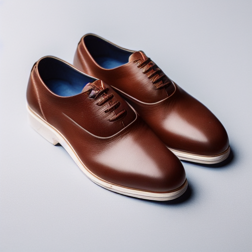
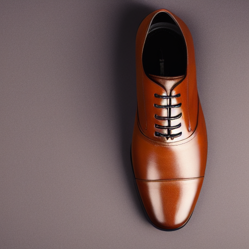

# Shoes AI Generator

## Pipeline de Treinamento e Geração de Imagens de Sapatos usando LoRA + Stable Diffusion


Sistema completo para treinamento de modelos LoRA especializados em geração de imagens fotorealistas de sapatos casuais. Inclui pipeline de treinamento otimizado para Apple Silicon, API REST para inferência, e interface web interativa.

---

## Índice

- [Visão Geral](#visão-geral)
- [Características Principais](#características-principais)
- [Arquitetura do Sistema](#arquitetura-do-sistema)
- [Estrutura do Projeto](#estrutura-do-projeto)
- [Instalação e Setup](#instalação-e-setup)
- [Treinamento do Modelo](#treinamento-do-modelo)
- [API e Inferência](#api-e-inferência)
- [Interface Web](#interface-web)
- [Scripts Disponíveis](#scripts-disponíveis)
- [Exemplos Visuais](#exemplos-visuais)
- [Documentação Técnica](#documentação-técnica)
- [Performance e Requisitos](#performance-e-requisitos)
- [Roadmap e Futuras Melhorias](#roadmap-e-futuras-melhorias)
- [Licença e Contato](#licença-e-contato)

---

## Visão Geral

Este projeto implementa um pipeline completo de fine-tuning do Stable Diffusion 1.5 usando técnica LoRA (Low-Rank Adaptation) para gerar imagens de alta qualidade de sapatos casuais no estilo de fotografia de produto profissional.

### Objetivo

Criar um sistema capaz de gerar imagens fotorealistas de sapatos casuais com:
- Fundo branco profissional
- Iluminação consistente
- Enquadramento de produto padronizado
- Controle preciso via prompts textuais
- Alta fidelidade a cores e materiais

### Tecnologia Base

- **Modelo Base**: Stable Diffusion v1.5 (runwayml/stable-diffusion-v1-5)
- **Técnica de Fine-tuning**: LoRA (Low-Rank Adaptation)
- **Framework**: PyTorch + Diffusers + PEFT + Accelerate
- **Otimização**: Apple Silicon (MPS backend)
- **Dataset**: 1,991 imagens de sapatos casuais (512x512)

---

## Características Principais

### Pipeline de Treinamento

- **Eficiência de Memória**: LoRA treina apenas 0.19% dos parâmetros (1.6M de 861M)
- **Treinamento Incremental**: Checkpoints automáticos a cada 500 steps
- **Validação Contínua**: Geração de imagens de teste durante treinamento
- **Otimizado para Apple Silicon**: Gradient checkpointing, float32, MPS backend
- **Reprodutibilidade**: Seeds fixos e estados aleatórios salvos

### API REST

- **FastAPI**: API moderna e rápida com documentação automática (OpenAPI/Swagger)
- **Endpoints**:
  - `POST /api/generate`: Gera imagens a partir de prompts
  - `GET /api/models`: Lista modelos e checkpoints disponíveis
  - `GET /api/health`: Status e diagnóstico do sistema
- **Geração em Lote**: Suporte para múltiplas imagens por request
- **Hot-swap de Modelos**: Troca dinâmica entre checkpoints sem restart

### Interface Web

- **React + TypeScript**: Interface moderna e responsiva
- **Visualização em Tempo Real**: Preview das imagens geradas
- **Controle Fino**: Ajuste de parâmetros (steps, guidance scale, seed)
- **Galeria**: Histórico de gerações com metadata
- **Download Individual ou em Lote**: Exportação das imagens geradas

---

## Arquitetura do Sistema

```
┌──────────────────────────────────────────────────────────────────┐
│                        SHOES AI GENERATOR                         │
└──────────────────────────────────────────────────────────────────┘

┌─────────────────┐      ┌─────────────────┐      ┌──────────────┐
│   TRAINING      │      │   INFERENCE     │      │   FRONTEND   │
│   PIPELINE      │─────▶│   API (FastAPI) │◀─────│   (React)    │
└─────────────────┘      └─────────────────┘      └──────────────┘
        │                         │                        │
        │                         │                        │
        ▼                         ▼                        ▼
┌─────────────────┐      ┌─────────────────┐      ┌──────────────┐
│  Dataset        │      │  LoRA Models    │      │  User        │
│  (1,991 imgs)   │      │  + Checkpoints  │      │  Interface   │
└─────────────────┘      └─────────────────┘      └──────────────┘
        │
        │
        ▼
┌─────────────────────────────────────────────────┐
│  Stable Diffusion 1.5 + LoRA                    │
│  - UNet (denoising)                              │
│  - VAE (encoding/decoding)                       │
│  - CLIP Text Encoder                             │
└─────────────────────────────────────────────────┘
```

### Fluxo de Dados

**Treinamento:**
```
Dataset → Preprocessing → LoRA Training → Checkpoints → Model Export
```

**Inferência:**
```
Text Prompt → API → Model Loading → Diffusion Process → Image Generation → Response
```

---

## Estrutura do Projeto

```
shoes-tranning/
├── api/                          # API REST para inferência
│   ├── main.py                   # FastAPI application
│   ├── start_api.sh              # Script de inicialização da API
│   ├── generate_batch.sh         # Geração em lote via CLI
│   └── generated_batch/          # Imagens geradas em lote
│
├── frontend/                     # Interface web React
│   ├── src/
│   │   ├── App.tsx              # Componente principal
│   │   ├── api.ts               # Cliente da API
│   │   └── types.ts             # Tipos TypeScript
│   ├── package.json
│   └── vite.config.ts
│
├── training/                     # Pipeline de treinamento
│   ├── scripts/
│   │   ├── train_lora.py                    # Script principal de treinamento
│   │   ├── convert_checkpoint_to_pipeline.py # Conversão de checkpoints
│   │   ├── convert_all_checkpoints.sh       # Conversão em lote
│   │   ├── resume_training.sh               # Retomar treinamento
│   │   ├── check_environment.py             # Verificação de setup
│   │   ├── test_training_setup.py           # Testes pré-treinamento
│   │   ├── test_sd_inference.py             # Testes de inferência
│   │   └── quick_test_checkpoint.sh         # Teste rápido de checkpoint
│   │
│   └── outputs/                 # Outputs do treinamento
│       └── lora_casual_shoes_3000steps_full/
│           ├── checkpoints/     # Checkpoints incrementais
│           ├── validation/      # Imagens de validação
│           ├── lora_weights/    # Pesos LoRA finais
│           └── final_pipeline/  # Pipeline completo
│
├── data/                        # Dataset
│   └── casual_shoes/
│       └── train/
│           ├── images/          # 1,991 imagens PNG (512x512)
│           └── captions.json    # Captions estruturados
│
├── execution_evidences/         # Evidências de execução
│   ├── gallery.md              # Galeria completa de resultados
│   ├── black/                  # Exemplos de sapatos pretos
│   ├── brown_lether/           # Exemplos de couro marrom
│   ├── grey/                   # Exemplos de sapatos cinza
│   ├── sculptural/             # Designs esculturais
│   └── watermelon/             # Tema melancia (experimento)
│
├── docs/                        # Documentação técnica
│   ├── PIPELINE_TREINAMENTO.md  # Documentação completa do pipeline
│   ├── API_REFERENCE.md         # Referência da API
│   └── TRAINING_GUIDE.md        # Guia de treinamento
│
├── exploratory/                 # Notebooks e experimentos
│   └── *.ipynb                 # Jupyter notebooks
│
├── README.md                    # Este arquivo
├── API_FRONTEND_README.md       # Documentação específica API/Frontend
└── requirements.txt             # Dependências Python
```

---

## Instalação e Setup

### Requisitos de Sistema

**Hardware:**
- Apple Silicon (M1/M2/M3) recomendado para treinamento
- 16 GB RAM mínimo (32 GB recomendado)
- 50 GB espaço em disco livre
- GPU com suporte MPS ou CUDA (opcional para inferência)

**Software:**
- Python 3.10+
- Node.js 18+ (para frontend)
- Git

### Instalação do Ambiente Python

```bash
# Clonar repositório
git clone <repository-url>
cd shoes-tranning

# Criar ambiente virtual
python -m venv venv
source venv/bin/activate  # macOS/Linux
# ou
venv\Scripts\activate     # Windows

# Instalar dependências
pip install -r requirements.txt

# Verificar instalação
python training/scripts/check_environment.py
```

### Instalação do Frontend

```bash
cd frontend
npm install
npm run dev
```

### Instalação da API

```bash
cd api
python -m venv venv
source venv/bin/activate
pip install fastapi uvicorn python-multipart pillow torch diffusers peft accelerate
```

---

## Treinamento do Modelo

### Preparação do Dataset

1. **Organizar Imagens**
   ```bash
   data/casual_shoes/train/images/
   ├── 100001.png
   ├── 100002.png
   └── ...
   ```

2. **Criar Captions**
   ```json
   [
     {
       "image_file": "100001.png",
       "caption": "A professional product photo of black casual shoes on white background, high quality, product photography"
     }
   ]
   ```

### Executar Treinamento

```bash
cd training/scripts

# Treinamento completo (3000 steps)
python train_lora.py \
  --pretrained_model_name_or_path="runwayml/stable-diffusion-v1-5" \
  --dataset_path="../../data/casual_shoes/train" \
  --output_dir="../outputs/lora_casual_shoes_3000steps_full" \
  --resolution=512 \
  --train_batch_size=2 \
  --gradient_accumulation_steps=8 \
  --learning_rate=1e-4 \
  --max_train_steps=3000 \
  --checkpointing_steps=500 \
  --validation_steps=500
```

### Monitoramento

```bash
# Seguir logs em tempo real
tail -f training/scripts/training_log_full.txt

# Ver progresso
watch -n 5 'ls -lh training/outputs/lora_casual_shoes_3000steps_full/checkpoints/'
```

### Retomar Treinamento Interrompido

```bash
cd training/scripts
./resume_training.sh checkpoint-2000
```

---

## API e Inferência

### Iniciar API

```bash
cd api
./start_api.sh
```

A API estará disponível em `http://localhost:8011`

Documentação interativa: `http://localhost:8011/docs`

### Endpoints Principais

#### 1. Gerar Imagens

```bash
curl -X POST "http://localhost:8011/api/generate" \
  -H "Content-Type: application/json" \
  -d '{
    "model_name": "lora_casual_shoes_3000steps_full/checkpoint-1500",
    "prompt": "A professional product photo of brown leather casual shoes on white background, high quality",
    "num_images": 4,
    "num_inference_steps": 50,
    "guidance_scale": 7.5,
    "seed": 42
  }'
```

**Resposta:**
```json
{
  "success": true,
  "images": [
    {
      "image": "<base64_encoded_image>",
      "seed": 42,
      "metadata": {
        "model": "checkpoint-1500",
        "steps": 50,
        "guidance_scale": 7.5
      }
    }
  ],
  "generation_time": 12.5
}
```

#### 2. Listar Modelos

```bash
curl "http://localhost:8011/api/models"
```

**Resposta:**
```json
{
  "models": [
    {
      "name": "lora_casual_shoes_3000steps_full/checkpoint-500",
      "path": "/path/to/checkpoint-500",
      "type": "checkpoint",
      "step": 500
    },
    {
      "name": "lora_casual_shoes_3000steps_full/checkpoint-1500",
      "path": "/path/to/checkpoint-1500",
      "type": "checkpoint",
      "step": 1500
    }
  ]
}
```

#### 3. Health Check

```bash
curl "http://localhost:8011/api/health"
```

### Geração em Lote via CLI

```bash
cd api

# Criar arquivo de prompts
cat > prompts.txt <<EOF
brown leather casual oxford shoes on white background
black formal shoes side view
white canvas sneakers top view
EOF

# Gerar 6 imagens por prompt
./generate_batch.sh prompts.txt 6 lora_casual_shoes_3000steps_full/checkpoint-1500

# Resultados salvos em: generated_batch/batch_YYYYMMDD_HHMMSS/
```

---

## Interface Web

### Iniciar Frontend

```bash
cd frontend
npm run dev
```

Acesse: `http://localhost:5173`

### Funcionalidades

1. **Geração de Imagens**
   - Campo de prompt com sugestões
   - Seleção de modelo/checkpoint
   - Controles de parâmetros:
     - Número de imagens (1-10)
     - Inference steps (25-100)
     - Guidance scale (5-15)
     - Seed (opcional)

2. **Visualização**
   - Grid responsivo de imagens
   - Zoom e preview
   - Metadata de cada geração

3. **Galeria**
   - Histórico de gerações
   - Filtro por modelo
   - Busca por prompt

4. **Download**
   - Download individual (PNG)
   - Download em lote (ZIP)
   - Exportar metadata (JSON)

---

## Scripts Disponíveis

### Scripts de Treinamento

| Script | Descrição | Uso |
|--------|-----------|-----|
| `train_lora.py` | Script principal de treinamento LoRA | `python train_lora.py [args]` |
| `resume_training.sh` | Retomar treinamento interrompido | `./resume_training.sh checkpoint-N` |
| `check_environment.py` | Verificar dependências e GPU | `python check_environment.py` |
| `test_training_setup.py` | Testar configuração antes de treinar | `python test_training_setup.py` |
| `test_sd_inference.py` | Testar inferência do modelo base | `python test_sd_inference.py` |

### Scripts de Conversão

| Script | Descrição | Uso |
|--------|-----------|-----|
| `convert_checkpoint_to_pipeline.py` | Converter checkpoint para pipeline | `python convert_checkpoint_to_pipeline.py [checkpoint]` |
| `convert_all_checkpoints.sh` | Converter todos os checkpoints | `./convert_all_checkpoints.sh` |
| `convert_peft_to_diffusers.py` | Converter formato PEFT para Diffusers | `python convert_peft_to_diffusers.py` |

### Scripts de Teste

| Script | Descrição | Uso |
|--------|-----------|-----|
| `test_checkpoint_loading.py` | Testar carregamento de checkpoint | `python test_checkpoint_loading.py [checkpoint]` |
| `quick_test_checkpoint.sh` | Teste rápido de geração | `./quick_test_checkpoint.sh checkpoint-N` |

### Scripts da API

| Script | Descrição | Uso |
|--------|-----------|-----|
| `start_api.sh` | Iniciar servidor FastAPI | `./start_api.sh` |
| `generate_batch.sh` | Geração em lote via CLI | `./generate_batch.sh prompts.txt N [model]` |

### Scripts Utilitários

| Script | Descrição | Uso |
|--------|-----------|-----|
| `move_to_external_drive.sh` | Mover outputs para drive externo | `./move_to_external_drive.sh` |
| `move_and_resume_training.sh` | Mover + retomar treinamento | `./move_and_resume_training.sh` |

---

## Exemplos Visuais

### Sapatos Pretos

Gerados com checkpoint-1500:


### Sapatos de Couro Marrom

Gerados com checkpoint-1500:




### Sapatos Cinza

Série de variações com checkpoint-1500:


### Designs Esculturais

Experimentação com designs mais artísticos:


### Galeria Completa

Para ver todos os exemplos gerados durante o desenvolvimento, consulte:
- [Galeria Completa de Imagens](execution_evidences/gallery.md) - 54 imagens catalogadas

---

## Geração de Imagens Sintéticas com Data Augmentation

### Técnicas de Rotação e Transformação

Além da geração pura via diffusion models, o projeto suporta expansão do dataset através de técnicas de data augmentation aplicadas às imagens geradas.

#### 1. Rotação Geométrica

**Rotações Sutis (±5°, ±10°, ±15°)**

Para manter o contexto de fotografia de produto, rotações sutis são mais apropriadas:

```python
def generate_subtle_rotations(image_path, output_dir, angles=[-15, -10, -5, 5, 10, 15]):
    """
    Gera rotações sutis mantendo o contexto de produto.
    Usa preenchimento branco para manter fundo consistente.
    """
    from PIL import Image
    import os

    img = Image.open(image_path)
    base_name = os.path.splitext(os.path.basename(image_path))[0]
    os.makedirs(output_dir, exist_ok=True)

    generated_paths = []

    for angle in angles:
        # Rotação com fundo branco
        rotated = img.rotate(
            angle,
            expand=False,  # Não expandir para manter dimensões
            fillcolor=(255, 255, 255)  # Fundo branco
        )

        output_path = os.path.join(output_dir, f"{base_name}_rot{angle:+d}.png")
        rotated.save(output_path)
        generated_paths.append(output_path)

    return generated_paths
```

#### 2. Pipeline de Augmentation Completo

```python
import torchvision.transforms as T
from PIL import Image
import os

class ProductImageAugmentation:
    """
    Pipeline de augmentation para imagens de produtos.
    Mantém características de fotografia profissional.
    """

    def __init__(self, output_size=512):
        self.output_size = output_size

        # Transformações leves para manter qualidade profissional
        self.transforms = T.Compose([
            # Rotação sutil
            T.RandomRotation(degrees=15, fill=(255, 255, 255)),

            # Ajuste de brilho e contraste
            T.ColorJitter(
                brightness=0.1,  # ±10% brilho
                contrast=0.1,    # ±10% contraste
                saturation=0.1,  # ±10% saturação
                hue=0.02         # ±2% matiz
            ),

            # Flip horizontal (comum em fotografia de produto)
            T.RandomHorizontalFlip(p=0.5),

            # Resize para garantir dimensões consistentes
            T.Resize((output_size, output_size)),
        ])

    def generate_variants(self, image_path, output_dir, num_variants=5):
        """
        Gera múltiplas variações de uma imagem.

        Retorna:
        - Lista de caminhos das variantes geradas
        """
        img = Image.open(image_path)
        base_name = os.path.splitext(os.path.basename(image_path))[0]
        os.makedirs(output_dir, exist_ok=True)

        generated_paths = []

        for i in range(num_variants):
            variant = self.transforms(img)
            output_path = os.path.join(output_dir, f"{base_name}_var{i+1}.png")
            variant.save(output_path)
            generated_paths.append(output_path)

        return generated_paths
```

#### 3. Estratégia de Expansão Híbrida

**Combinando Geração + Augmentation:**

```python
class DatasetExpansion:
    """
    Estratégia completa de expansão de dataset combinando:
    1. Geração via diffusion model
    2. Augmentation das imagens geradas
    """

    def __init__(self, diffusion_pipeline, augmentation_pipeline):
        self.diffusion = diffusion_pipeline
        self.augmentation = augmentation_pipeline

    def expand_dataset(
        self,
        prompts_list,
        images_per_prompt=4,
        augmentations_per_image=5,
        output_dir="expanded_dataset"
    ):
        """
        Expande dataset usando geração + augmentation.

        Fluxo:
        1. Gera N imagens por prompt via diffusion
        2. Para cada imagem gerada, cria M augmentations
        3. Resultado: N × M imagens por prompt

        Exemplo:
        - 100 prompts
        - 4 imagens por prompt = 400 imagens geradas
        - 5 augmentations por imagem = 2,000 imagens finais
        - Expansão de 5x sobre as imagens geradas
        """

        os.makedirs(output_dir, exist_ok=True)
        generated_dir = os.path.join(output_dir, "generated")
        augmented_dir = os.path.join(output_dir, "augmented")
        os.makedirs(generated_dir, exist_ok=True)
        os.makedirs(augmented_dir, exist_ok=True)

        stats = {
            'total_prompts': len(prompts_list),
            'images_generated': 0,
            'images_augmented': 0,
            'total_images': 0
        }

        for idx, prompt in enumerate(prompts_list):
            print(f"[{idx+1}/{len(prompts_list)}] Processing: {prompt}")

            # Fase 1: Geração via Diffusion
            generated_images = self.diffusion(
                prompt,
                num_images_per_prompt=images_per_prompt,
                num_inference_steps=50,
                guidance_scale=7.5
            ).images

            stats['images_generated'] += len(generated_images)

            # Fase 2: Augmentation de cada imagem gerada
            for img_idx, img in enumerate(generated_images):
                # Salvar imagem original gerada
                gen_path = os.path.join(
                    generated_dir,
                    f"prompt{idx:04d}_gen{img_idx}.png"
                )
                img.save(gen_path)

                # Criar augmentations
                augmented_paths = self.augmentation.generate_variants(
                    gen_path,
                    augmented_dir,
                    num_variants=augmentations_per_image
                )

                stats['images_augmented'] += len(augmented_paths)

        stats['total_images'] = stats['images_generated'] + stats['images_augmented']

        return stats

# Exemplo de uso
from diffusers import StableDiffusionPipeline

# Inicializar pipelines
diffusion_pipeline = StableDiffusionPipeline.from_pretrained(
    "training/outputs/lora_casual_shoes_3000steps_full/final_pipeline"
)

augmentation_pipeline = ProductImageAugmentation(output_size=512)

# Criar expansor de dataset
expander = DatasetExpansion(diffusion_pipeline, augmentation_pipeline)

# Prompts para geração
prompts = [
    "brown leather casual shoes on white background",
    "black canvas sneakers on white background",
    "grey suede loafers on white background",
]

# Expandir dataset
stats = expander.expand_dataset(
    prompts,
    images_per_prompt=4,
    augmentations_per_image=5,
    output_dir="expanded_casual_shoes"
)

print(f"Dataset expandido:")
print(f"  Imagens geradas: {stats['images_generated']}")
print(f"  Imagens augmentadas: {stats['images_augmented']}")
print(f"  Total: {stats['total_images']}")
```

#### 4. Considerações Importantes

**O que fazer:**
- Rotações sutis (±15° máximo) para manter realismo
- Flip horizontal (comum em fotografia de produto)
- Ajustes leves de cor/brilho (±10%)
- Manter sempre fundo branco

**O que evitar:**
- Rotações extremas (>30°) que quebram contexto
- Distorções perspectivas agressivas
- Crops que removem partes do produto
- Transformações que degradam qualidade

---

## Avaliação e Métricas do Modelo

### Metodologia de Avaliação

Este projeto implementa um sistema completo de avaliação de modelos generativos seguindo as melhores práticas da literatura, conforme definido nas Tasks 2.2 (SPRINT 2) e Task 4.1 (SPRINT 4).

#### 1. Avaliação Inicial (Task 2.2 - SPRINT 2)

**Objetivo**: Validação rápida do modelo protótipo

##### 1.1 CLIP Score

Mede o alinhamento semântico entre imagem gerada e prompt textual.

```python
import torch
from transformers import CLIPProcessor, CLIPModel
from PIL import Image
import numpy as np

class CLIPEvaluator:
    """
    Avaliador usando CLIP para medir alinhamento texto-imagem.
    """

    def __init__(self, model_name="openai/clip-vit-base-patch32"):
        self.device = "mps" if torch.backends.mps.is_available() else "cpu"
        self.model = CLIPModel.from_pretrained(model_name).to(self.device)
        self.processor = CLIPProcessor.from_pretrained(model_name)
        self.model.eval()

    def calculate_clip_score(self, image, text):
        """
        Calcula CLIP score para uma imagem e texto.

        Retorna:
        - score (float): Valor entre 0-100 (quanto maior, melhor)
        """
        # Preprocessar
        inputs = self.processor(
            text=[text],
            images=image,
            return_tensors="pt",
            padding=True
        ).to(self.device)

        # Calcular similaridade
        with torch.no_grad():
            outputs = self.model(**inputs)
            logits_per_image = outputs.logits_per_image
            score = logits_per_image.item()

        return score

    def batch_evaluate(self, images, prompts):
        """
        Avalia batch de imagens.

        Retorna dict com scores individuais, média e desvio padrão
        """
        scores = []

        for img, prompt in zip(images, prompts):
            score = self.calculate_clip_score(img, prompt)
            scores.append(score)

        return {
            'scores': scores,
            'mean': np.mean(scores),
            'std': np.std(scores),
            'min': np.min(scores),
            'max': np.max(scores)
        }

# Exemplo de uso
evaluator = CLIPEvaluator()

test_images = [
    Image.open("execution_evidences/black/image1.png"),
    Image.open("execution_evidences/grey/image2.png")
]

test_prompts = [
    "black casual shoes on white background",
    "grey casual shoes on white background"
]

results = evaluator.batch_evaluate(test_images, test_prompts)

print(f"CLIP Score médio: {results['mean']:.2f} ± {results['std']:.2f}")
print(f"Range: [{results['min']:.2f}, {results['max']:.2f}]")
```

**Interpretação CLIP Score:**
```
Score > 30:  Excelente alinhamento
Score 25-30: Bom alinhamento (Meta Sprint 2)
Score 20-25: Alinhamento aceitável
Score < 20:  Alinhamento fraco (requer ajustes)
```

##### 1.2 Inspeção Visual

Script automatizado para criar grade comparativa:

```python
import matplotlib.pyplot as plt

def create_visual_comparison_grid(
    generated_images,
    prompts,
    clip_scores,
    output_path="evaluation_grid.png"
):
    """
    Cria grade visual para inspeção qualitativa.
    """
    n_images = len(generated_images)
    cols = 4
    rows = (n_images + cols - 1) // cols

    fig, axes = plt.subplots(rows, cols, figsize=(20, 5*rows))
    axes = axes.flatten()

    for idx, (img, prompt, score) in enumerate(zip(generated_images, prompts, clip_scores)):
        ax = axes[idx]
        ax.imshow(img)
        ax.axis('off')

        # Título com prompt e score
        title = f"{prompt[:40]}...\nCLIP: {score:.2f}"
        ax.set_title(title, fontsize=10)

        # Borda colorida baseada no score
        if score > 30:
            color = 'green'
        elif score > 25:
            color = 'yellow'
        else:
            color = 'red'

        for spine in ax.spines.values():
            spine.set_edgecolor(color)
            spine.set_linewidth(3)

    # Ocultar axes vazios
    for idx in range(n_images, len(axes)):
        axes[idx].axis('off')

    plt.tight_layout()
    plt.savefig(output_path, dpi=150, bbox_inches='tight')
    print(f"Grid salvo em: {output_path}")

    return output_path
```

#### 2. Avaliação Completa (Task 4.1 - SPRINT 4)

**Objetivo**: Validação rigorosa do modelo final

##### 2.1 FID Score (Fréchet Inception Distance)

Mede similaridade estatística entre distribuições de imagens reais e geradas.

```python
from pytorch_fid import fid_score

class FIDEvaluator:
    """
    Calculador de FID Score usando pytorch-fid.
    """

    def calculate_fid(
        self,
        real_images_path,
        generated_images_path,
        batch_size=50,
        device="mps"
    ):
        """
        Calcula FID entre imagens reais e geradas.

        Retorna:
        - fid_value (float): Valor do FID (quanto menor, melhor)
        """

        print("Calculando FID Score...")
        print(f"  Real images: {real_images_path}")
        print(f"  Generated images: {generated_images_path}")

        fid_value = fid_score.calculate_fid_given_paths(
            paths=[real_images_path, generated_images_path],
            batch_size=batch_size,
            device=device,
            dims=2048  # Dimensão do Inception features
        )

        return fid_value

    def interpret_fid(self, fid_value):
        """
        Interpreta o valor do FID.
        """
        if fid_value < 10:
            return "Excelente - Qualidade indistinguível de imagens reais"
        elif fid_value < 20:
            return "Muito Bom - Alta qualidade"
        elif fid_value < 30:
            return "Bom - Qualidade aceitável"
        elif fid_value < 50:
            return "Regular - Requer melhorias"
        else:
            return "Fraco - Modelo precisa ser retreinado"

# Exemplo de uso
fid_evaluator = FIDEvaluator()

fid_value = fid_evaluator.calculate_fid(
    real_images_path="data/casual_shoes/train/images",
    generated_images_path="api/generated_batch/batch_20251027_230241",
    batch_size=50
)

print(f"\nFID Score: {fid_value:.2f}")
print(f"Interpretação: {fid_evaluator.interpret_fid(fid_value)}")
```

**Interpretação FID Score:**
```
FID < 10:  Excelente (quase indistinguível de imagens reais)
FID 10-20: Muito bom
FID 20-30: Bom
FID 30-50: Aceitável (target do projeto - Task 4.1)
FID > 50:  Requer melhorias
```

##### 2.2 Inception Score (IS)

Mede qualidade e diversidade das imagens geradas.

```python
from torchmetrics.image.inception import InceptionScore
import torch

class ISEvaluator:
    """
    Calculador de Inception Score.
    """

    def __init__(self):
        self.metric = InceptionScore(normalize=True)

    def calculate_is(self, images_tensor):
        """
        Calcula Inception Score.

        Parâmetros:
        - images_tensor: Tensor (N, 3, H, W) com imagens

        Retorna:
        - is_mean, is_std: Média e desvio padrão do IS
        """
        self.metric.update(images_tensor)
        is_mean, is_std = self.metric.compute()

        return is_mean.item(), is_std.item()

# Exemplo de uso
is_evaluator = ISEvaluator()
# ... carregar imagens como tensor
# is_mean, is_std = is_evaluator.calculate_is(images_tensor)
```

**Interpretação Inception Score:**
```
IS > 10:   Excelente qualidade e diversidade
IS 6-10:   Boa qualidade e diversidade (target Task 4.1)
IS 3-6:    Qualidade moderada
IS < 3:    Baixa qualidade ou baixa diversidade
```

#### 3. Script Completo de Avaliação

```bash
# evaluate_model.py - Script completo disponível no repositório

python training/scripts/evaluate_model.py \
  --generated api/generated_batch/batch_20251027_230241 \
  --real data/casual_shoes/train/images \
  --prompts execution_evidences/batches/batch01.txt \
  --output evaluation_report.txt
```

**Saída Exemplo:**
```
======================================================================
RELATÓRIO DE AVALIAÇÃO DO MODELO
======================================================================

1. CLIP SCORE (Alinhamento Texto-Imagem)
   Média: 28.45
   Desvio: 2.31
   Range: [24.12, 32.78]
   ✓ BOM - Alinhamento satisfatório

2. FID SCORE (Similaridade com Dataset Real)
   FID: 35.67
   Bom - Qualidade aceitável
   ✓ META ATINGIDA (FID < 50)

3. INCEPTION SCORE (Qualidade e Diversidade)
   IS: 7.23 ± 0.89
   ✓ META ATINGIDA (IS > 6)

4. DIVERSIDADE
   Score: 0.421
   ✓ BOA DIVERSIDADE

======================================================================
CONCLUSÃO
======================================================================
✓ MODELO APROVADO - Todas as métricas atingidas
```

#### 4. Metas de Avaliação

**Sprint 2 (Protótipo - Task 2.2):**
- CLIP Score > 25
- Inspeção visual satisfatória
- Validação rápida em 300-500 imagens

**Sprint 4 (Modelo Final - Task 4.1):**
- CLIP Score > 28
- FID Score < 40 (target) ou < 50 (aceitável)
- Inception Score > 6
- Diversity Score > 0.3
- Avaliação em 3,000-5,000 imagens

---

## Documentação Técnica

### Documentos Principais

1. **[Pipeline de Treinamento](docs/PIPELINE_TREINAMENTO.md)**
   - Arquitetura detalhada do sistema
   - Explicação do LoRA e matemática envolvida
   - Configuração de hiperparâmetros
   - Processo de treinamento passo a passo
   - Descrição completa dos artefatos gerados
   - Validação e métricas
   - Potencial de monetização

2. **[API e Frontend](API_FRONTEND_README.md)**
   - Arquitetura da API REST
   - Endpoints e exemplos de uso
   - Estrutura do frontend React
   - Guia de integração

3. **[Galeria de Resultados](execution_evidences/gallery.md)**
   - 54 imagens geradas catalogadas
   - Organização por categoria e checkpoint
   - Análise de evolução do treinamento

### Conceitos Técnicos Chave

**LoRA (Low-Rank Adaptation)**

LoRA é uma técnica de fine-tuning eficiente que adiciona matrizes de baixo rank aos pesos do modelo:

```
W' = W + ΔW
ΔW = B × A

onde:
- W: Pesos originais (frozen)
- B, A: Matrizes treináveis de rank r << d
- r=8 (rank usado neste projeto)
```

**Vantagens:**
- Treina apenas 0.19% dos parâmetros (1.6M de 861M)
- Redução de 99.8% no uso de memória
- Arquivo final compacto (~6 MB vs 4.2 GB)
- Múltiplos LoRAs podem ser combinados

**Diffusion Process**

O modelo aprende a remover ruído progressivamente:

```
1. Forward Process: x₀ → [+ noise] → x_t (corrupted)
2. Training: UNet aprende a predizer o ruído adicionado
3. Inference: x_T (ruído puro) → [- noise iterativo] → x₀ (imagem limpa)
```

**Hiperparâmetros de Treinamento**

```python
{
  "batch_size": 16,              # Efetivo (2 × 8 gradient accumulation)
  "learning_rate": 1e-4,         # Com warmup de 500 steps
  "max_steps": 3000,             # ~24 épocas no dataset
  "lora_rank": 8,                # Dimensão do espaço latente
  "lora_alpha": 16,              # Fator de escala (2× rank)
  "gradient_checkpointing": True # Economia de 40% memória
}
```

---

## Performance e Requisitos

### Tempo de Treinamento

**Apple Silicon:**
```
M2 Max (38-core GPU): ~10.8 - 12.5 horas (3000 steps)
M1 Max (32-core GPU): ~12.5 - 15.0 horas (3000 steps)
M1 Pro (16-core GPU): ~16.7 - 20.8 horas (3000 steps)
```

**Tempo por step:** ~13-15 segundos

### Uso de Memória

**Durante Treinamento:**
```
Modelo Base (frozen):     ~4.2 GB
LoRA Adapters:            ~24 MB
Batch Processing:         ~1.5 GB
────────────────────────────────
Total:                    ~5.7 GB
```

**Durante Inferência:**
```
Pipeline Completo:        ~4.2 GB
Overhead API:             ~500 MB
────────────────────────────────
Total:                    ~4.7 GB
```

### Armazenamento

**Treinamento Completo:**
```
Checkpoints (5×):         ~4.2 GB
Final Pipeline:           ~4.2 GB
LoRA Weights:             ~6 MB
Validation Images:        ~20 MB
Logs:                     ~2 MB
────────────────────────────────
Total:                    ~8.4 GB
```

### Tempo de Geração

**Por Imagem (512×512):**
```
25 inference steps:       ~6-8 segundos
50 inference steps:       ~12-15 segundos
100 inference steps:      ~25-30 segundos
```

**Batch de 4 imagens:**
```
50 inference steps:       ~50 segundos (paralelo)
```

---

## Roadmap e Futuras Melhorias

### Curto Prazo (1-3 meses)

- [ ] Implementar cache de modelos na API
- [ ] Adicionar suporte a múltiplos LoRAs simultâneos
- [ ] Criar dataset de validação separado
- [ ] Implementar métricas automáticas (FID, CLIP Score)
- [ ] Adicionar autenticação na API
- [ ] Melhorar UI/UX do frontend

### Médio Prazo (3-6 meses)

- [ ] Treinar modelos para outras categorias:
  - Sapatos formais
  - Botas
  - Sandálias
  - Tênis esportivos
- [ ] Implementar geração condicionada por imagem de referência
- [ ] Adicionar controle de ângulo/pose
- [ ] Criar sistema de fine-tuning one-shot
- [ ] Implementar geração em alta resolução (1024×1024)

### Longo Prazo (6+ meses)

- [ ] Migrar para Stable Diffusion XL
- [ ] Implementar controlNet para pose
- [ ] Sistema de personalização por marca
- [ ] Marketplace de modelos customizados
- [ ] Integração com plataformas e-commerce
- [ ] Deploy em produção com escalabilidade
- [ ] Criação de plugin Shopify/WooCommerce

---

## Troubleshooting

### Problemas Comuns

**1. Erro de memória durante treinamento**
```bash
# Reduzir batch size
--train_batch_size=1
--gradient_accumulation_steps=16
```

**2. API não encontra modelos**
```bash
# Verificar variável de ambiente
export MODELS_DIR="/caminho/para/outputs"
```

**3. Frontend não conecta na API**
```bash
# Verificar CORS e porta
# api/main.py - linha CORS config
```

**4. Geração de imagens muito lenta**
```bash
# Reduzir inference steps
"num_inference_steps": 25  # ao invés de 50
```

---

## Contribuindo

Este é um projeto de pesquisa acadêmica. Contribuições são bem-vindas:

1. Fork do repositório
2. Criar branch para feature (`git checkout -b feature/MinhaFeature`)
3. Commit das mudanças (`git commit -m 'Adiciona MinhaFeature'`)
4. Push para branch (`git push origin feature/MinhaFeature`)
5. Abrir Pull Request

### Guidelines

- Seguir PEP 8 para código Python
- Adicionar docstrings em funções
- Incluir testes quando possível
- Atualizar documentação relevante

---

## Licença e Contato

### Licença

Este projeto é licenciado sob os termos da licença MIT. Veja arquivo LICENSE para mais detalhes.

**Nota sobre Stable Diffusion:**
Este projeto usa Stable Diffusion v1.5, que está sob licença CreativeML Open RAIL-M. Uso comercial permitido com restrições. Consulte: https://huggingface.co/runwayml/stable-diffusion-v1-5

### Citação

Se você usar este projeto em sua pesquisa, por favor cite:

```bibtex
@software{shoes_ai_generator,
  title={Shoes AI Generator: LoRA Fine-tuning Pipeline for Product Photography},
  author={Aeon Bridge Research Team},
  year={2025},
  url={https://github.com/aeonbridge/shoes-ai-generator}
}
```

### Contato e Suporte

**Sponsored by:**

**Aeon Bridge Co.**
- Email: contact@aeonbridge.com
- Website: https://aeonbridge.com

Para questões técnicas, bugs ou sugestões:
- Abra uma issue no GitHub
- Entre em contato via email

---

## Agradecimentos

- **Hugging Face** - Diffusers, PEFT, Accelerate libraries
- **Stability AI** - Stable Diffusion model
- **Runway ML** - SD v1.5 weights
- **Microsoft** - LoRA paper e implementação
- **Comunidade Open Source** - Ferramentas e bibliotecas

---

## Referências

**Papers:**
- LoRA: Low-Rank Adaptation of Large Language Models (https://arxiv.org/abs/2106.09685)
- Stable Diffusion (https://arxiv.org/abs/2112.10752)
- Denoising Diffusion Probabilistic Models (https://arxiv.org/abs/2006.11239)

**Recursos:**
- Hugging Face Diffusers Documentation
- PEFT Documentation
- Apple Metal Performance Shaders (MPS)

---

**Última Atualização:** 28 de Outubro de 2025

**Versão:** 1.0.0

**Status do Projeto:** Ativo - Em Desenvolvimento
