# Galeria de Imagens - Execution Evidences

Este documento apresenta uma galeria organizada de todas as imagens geradas durante o treinamento e testes do modelo LoRA para geração de sapatos casuais.

**Total de imagens**: 54 imagens

---

## Imagens do Diretório Raiz

### Screenshots da Interface

| API Interface | App Interface |
|--------------|---------------|
| 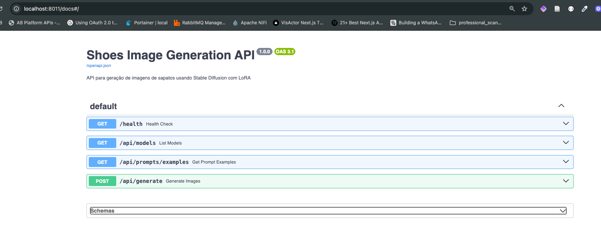 |  |

### Testes com Modelo Base e Checkpoints Iniciais

| Modelo | Imagem |
|--------|--------|
| Base Model | 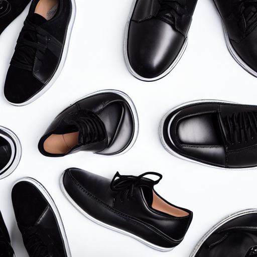 |
| Checkpoint 500 |  |

---

## Black - Sapatos Pretos

Geração de sapatos pretos usando diferentes checkpoints do modelo.

**Total**: 4 imagens

<table>
<tr>
<td width="50%">

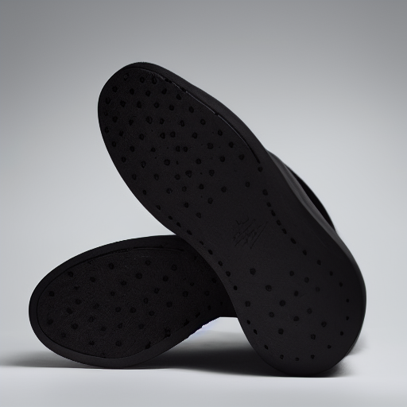
**Checkpoint 1000** - Seed: 3894493778

</td>
<td width="50%">

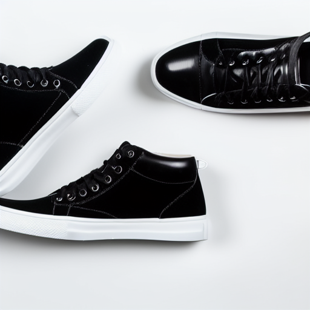
**Checkpoint 1000** - Seed: 3894493779

</td>
</tr>
<tr>
<td width="50%">

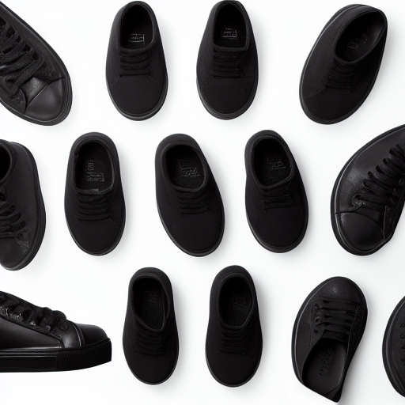
**Checkpoint 1500** - Seed: 3898295219

</td>
<td width="50%">

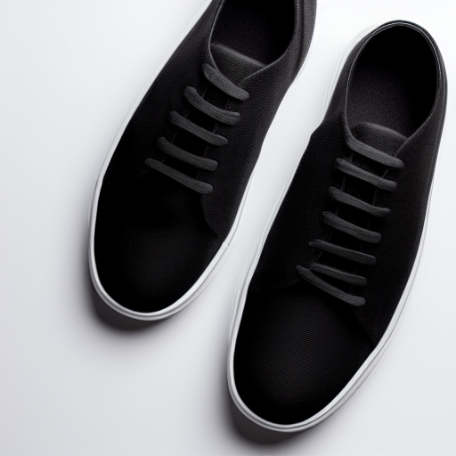
**Checkpoint 1500** - Seed: 3898295220

</td>
</tr>
</table>

---

## Brown Leather - Sapatos de Couro Marrom

Comparação entre referência (Gemini) e gerações do modelo treinado.

**Total**: 5 imagens (1 referência + 4 geradas)

<table>
<tr>
<td width="50%">

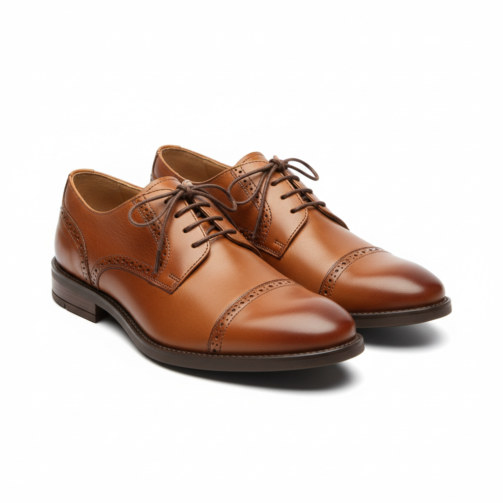
**Referência (Gemini)**

</td>
<td width="50%">

**Checkpoint 1500** - Seed: 3101469424

</td>
</tr>
<tr>
<td width="50%">

**Checkpoint 1500** - Seed: 3101469425

</td>
<td width="50%">

**Checkpoint 1500** - Seed: 3101469426

</td>
</tr>
<tr>
<td colspan="2" align="center">

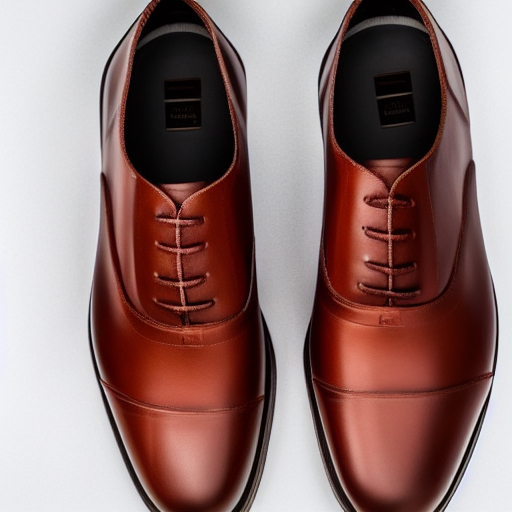
**Checkpoint 1500** - Seed: 3101469427

</td>
</tr>
</table>

---

## Grey - Sapatos Cinza

Série de gerações utilizando checkpoint 1500 para explorar variações de sapatos cinza.

**Total**: 8 imagens

<table>
<tr>
<td width="33%">

**Seed**: 2784716826

</td>
<td width="33%">

**Seed**: 2784716827

</td>
<td width="33%">

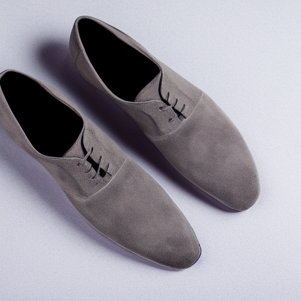
**Seed**: 2784716828

</td>
</tr>
<tr>
<td width="33%">

**Seed**: 2784716829

</td>
<td width="33%">

**Seed**: 2784716830

</td>
<td width="33%">

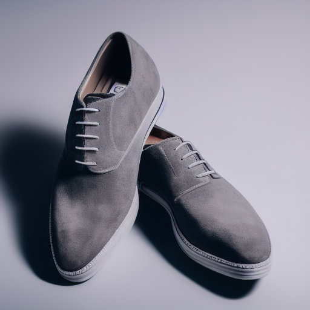
**Seed**: 2784716831

</td>
</tr>
<tr>
<td width="33%">

**Seed**: 2784716832

</td>
<td width="33%">

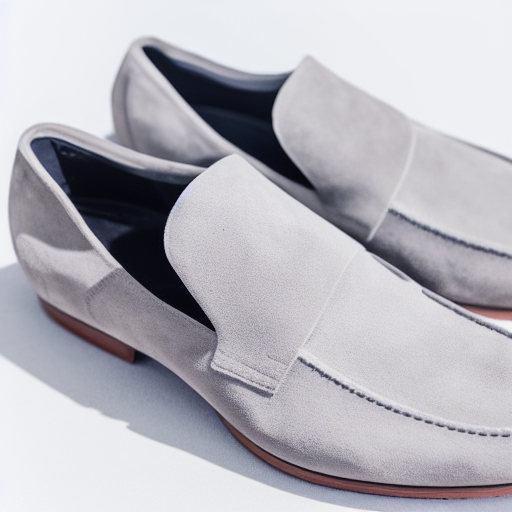
**Seed**: 2784716833

</td>
<td width="33%"></td>
</tr>
</table>

---

## Sculptural - Designs Esculturais

Experimentações com designs mais artísticos e escultural, comparando checkpoint 1500 e 3000.

**Total**: 9 imagens (1 referência + 8 geradas)

### Referência

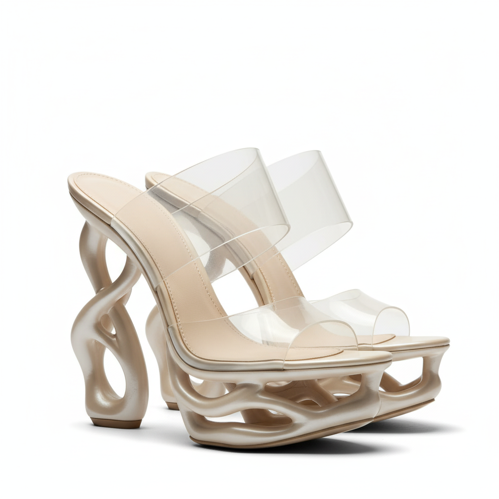
**Referência (Gemini)**

### Checkpoint 1500

<table>
<tr>
<td width="50%">

**Seed**: 974209925

</td>
<td width="50%">

**Seed**: 974209926

</td>
</tr>
<tr>
<td width="50%">

**Seed**: 974209927

</td>
<td width="50%">

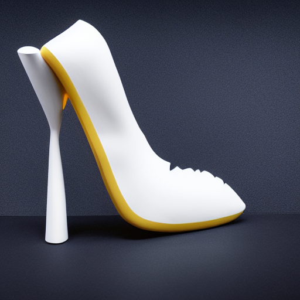
**Seed**: 974209928

</td>
</tr>
</table>

### Checkpoint 3000

<table>
<tr>
<td width="50%">

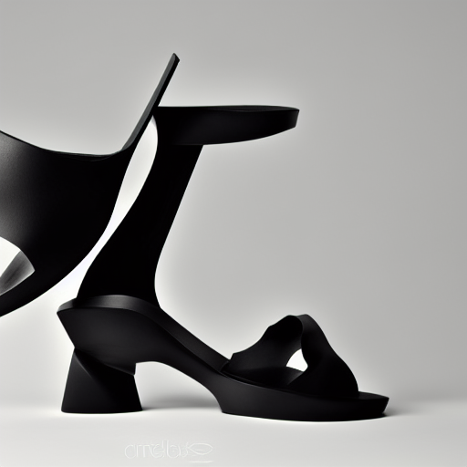
**Seed**: 138612625

</td>
<td width="50%">

**Seed**: 138612626

</td>
</tr>
<tr>
<td width="50%">

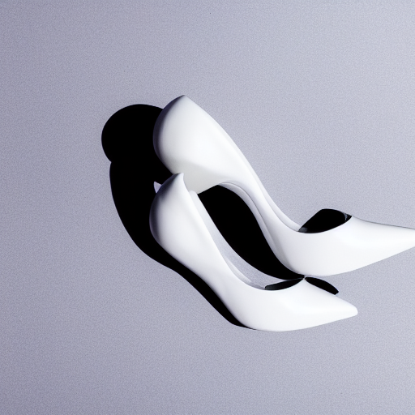
**Seed**: 138612627

</td>
<td width="50%">

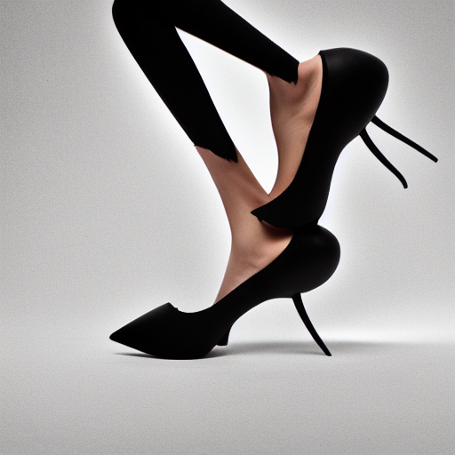
**Seed**: 138612628

</td>
</tr>
</table>

---

## Watermelon - Tema Melancia

Experimentação criativa com padrão de melancia. Esta categoria contém o maior número de imagens, testando múltiplos checkpoints desde 500 até 3000 steps.

**Total**: 27 imagens (1 referência + 26 geradas)

### Referência

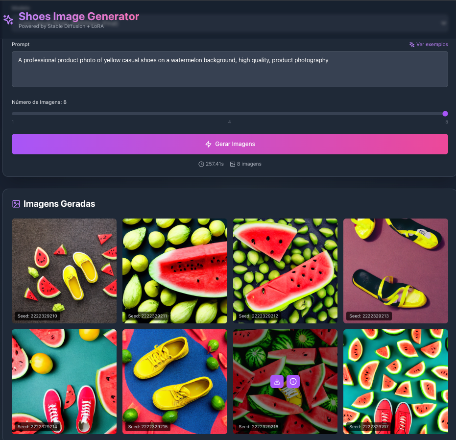
**Imagem de Referência**

### Modelo Final (3000 steps completos)

<table>
<tr>
<td width="50%">

**Final** - Seed: 2222329210

</td>
<td width="50%">

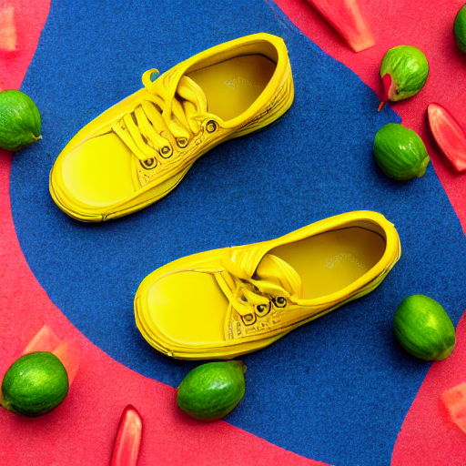
**Final** - Seed: 2222329215

</td>
</tr>
</table>

### Checkpoint 500

<table>
<tr>
<td width="33%">

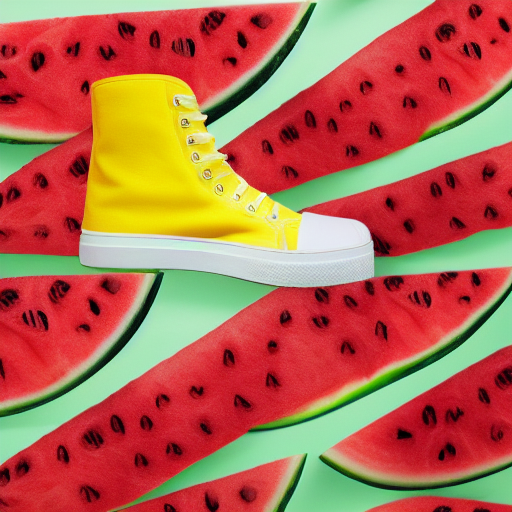
**Seed**: 2753453725

</td>
<td width="33%">

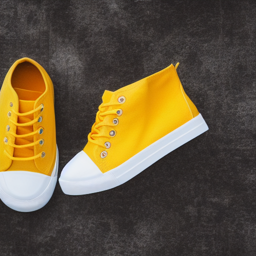
**Seed**: 2753453726

</td>
<td width="33%">

**Seed**: 2753453727

</td>
</tr>
</table>

### Checkpoint 1000

<table>
<tr>
<td width="50%">

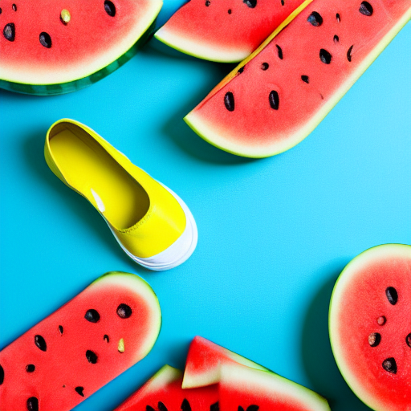
**Seed**: 285875781

</td>
<td width="50%">

**Seed**: 285875782

</td>
</tr>
<tr>
<td width="50%">

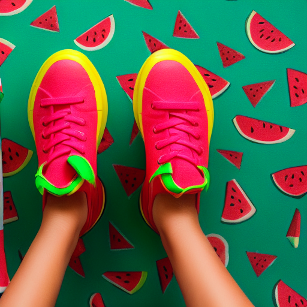
**Seed**: 285875783

</td>
<td width="50%">

**Seed**: 285875784

</td>
</tr>
</table>

### Checkpoint 1500

<table>
<tr>
<td width="50%">

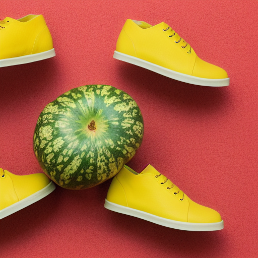
**Seed**: 3549761581

</td>
<td width="50%">

**Seed**: 3549761582

</td>
</tr>
<tr>
<td width="50%">

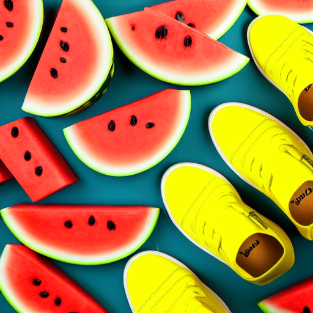
**Seed**: 3549761583

</td>
<td width="50%">

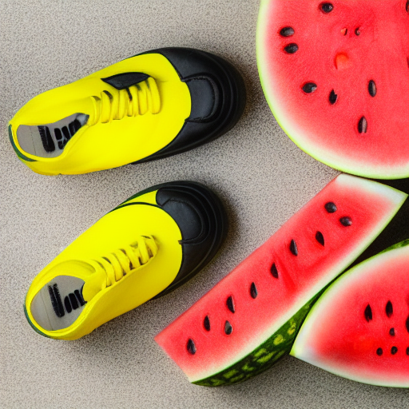
**Seed**: 3549761584

</td>
</tr>
</table>

### Checkpoint 2000

<table>
<tr>
<td width="50%">

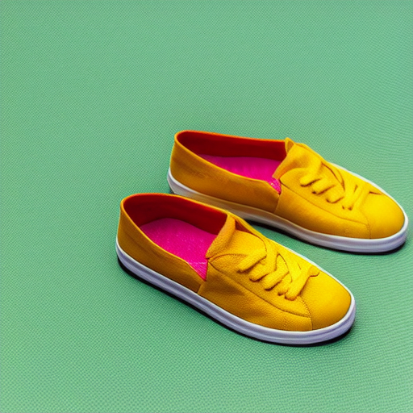
**Seed**: 1610776869

</td>
<td width="50%">

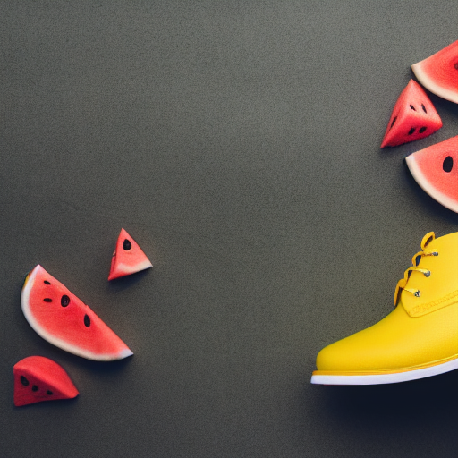
**Seed**: 1610776870

</td>
</tr>
<tr>
<td width="50%">

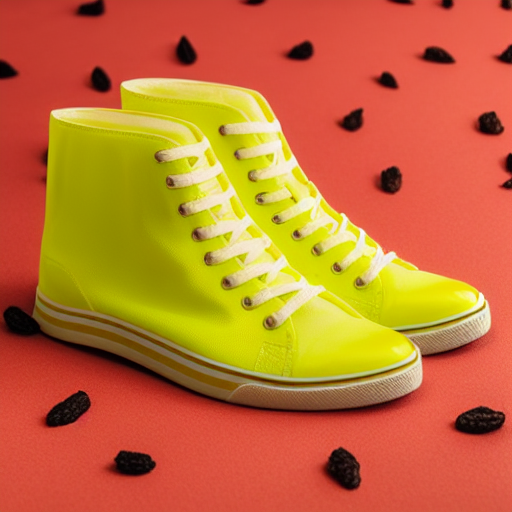
**Seed**: 1610776871

</td>
<td width="50%">

**Seed**: 1610776872

</td>
</tr>
</table>

### Checkpoint 2500

<table>
<tr>
<td width="50%">

**Seed**: 2566651083

</td>
<td width="50%">

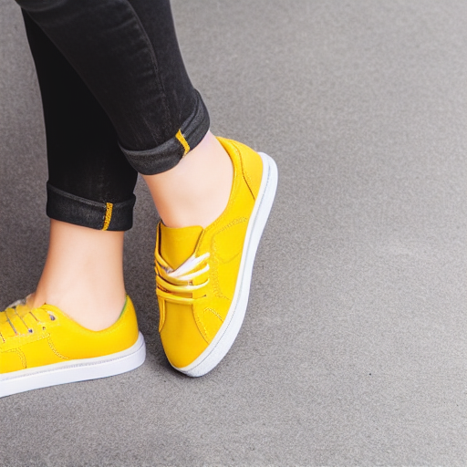
**Seed**: 2566651084

</td>
</tr>
<tr>
<td width="50%">

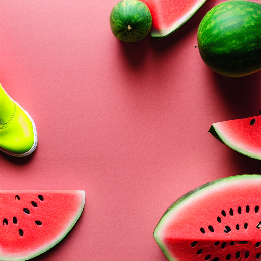
**Seed**: 2566651085

</td>
<td width="50%">

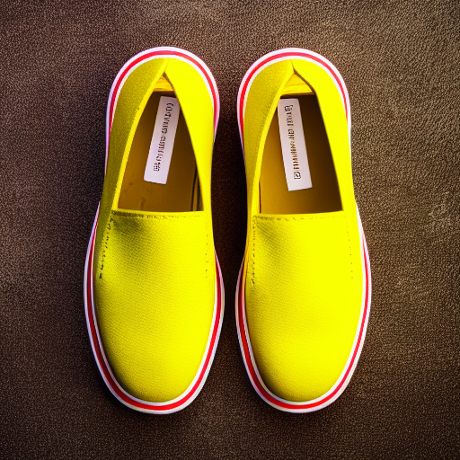
**Seed**: 2566651086

</td>
</tr>
</table>

### Checkpoint 3000

<table>
<tr>
<td width="50%">

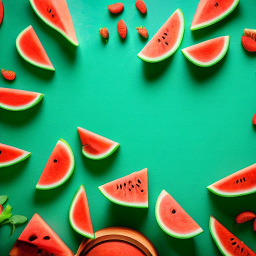
**Seed**: 7150256

</td>
<td width="50%">

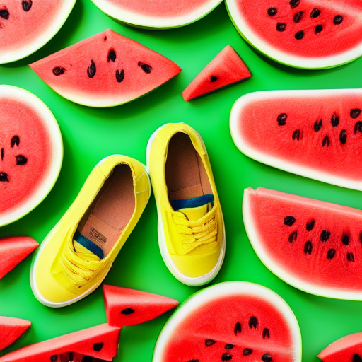
**Seed**: 7150257

</td>
</tr>
<tr>
<td width="50%">

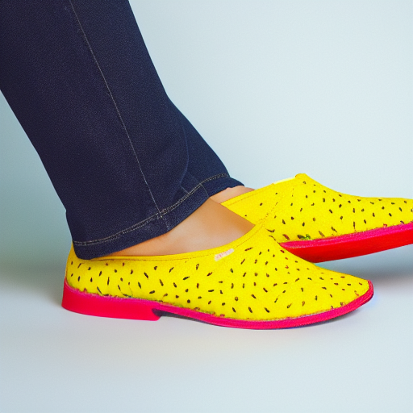
**Seed**: 7150258

</td>
<td width="50%">

**Seed**: 7150259

</td>
</tr>
</table>

---

## Resumo Estatístico

### Distribuição por Categoria

| Categoria | Quantidade | Checkpoints Testados |
|-----------|-----------|---------------------|
| Interface Screenshots | 2 | N/A |
| Base/Initial Tests | 2 | Base, 500 |
| Black | 4 | 1000, 1500 |
| Brown Leather | 5 | 1500 (+ referência) |
| Grey | 8 | 1500 |
| Sculptural | 9 | 1500, 3000 (+ referência) |
| Watermelon | 27 | 500, 1000, 1500, 2000, 2500, 3000, Final (+ referência) |
| **Total** | **54** | - |

### Distribuição por Checkpoint

| Checkpoint | Quantidade de Imagens |
|-----------|---------------------|
| Base | 1 |
| 500 | 4 |
| 1000 | 8 |
| 1500 | 16 |
| 2000 | 4 |
| 2500 | 4 |
| 3000 | 8 |
| Final | 2 |
| Referências/Screenshots | 7 |

### Observações

1. **Watermelon** é o tema mais explorado, com testes em todos os checkpoints disponíveis, permitindo análise completa da evolução do treinamento.

2. **Checkpoint 1500** foi o mais testado (16 imagens), indicando ser possivelmente um ponto de equilíbrio entre qualidade e tempo de treinamento.

3. As categorias incluem tanto gerações tradicionais (black, grey, brown) quanto experimentações criativas (watermelon, sculptural).

4. Algumas categorias incluem imagens de referência geradas pelo Gemini para comparação de qualidade.

---

**Última atualização**: 2025-10-28
**Modelo**: lora_casual_shoes_3000steps
**Framework**: Stable Diffusion + LoRA
